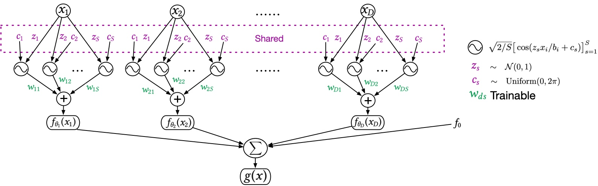

# GPNAM: Gaussian Process Neural Additive Models


*The framework of GPNAM. `$z_s, c_s$` and the sinusoidal function are predefined from the paper and do not require training. The only trainable parameter is `W` that maps to the output of each shape function.*

This repository contains the source code for the paper Gaussian Process Neural Additive Models that appears at AAAI 2024. 

Basically, the GPNAM constructs a Neural Additive Model (NAM) by a GP with Random Fourier Features as the shape function for each input feature, which leads to a convex optimization with a significant reduction in trainable parameters. 

## Sklearn interface

You can install the package by:
```
pip install gpnam
```

Then, you can run the model simply by:
```
from gpnam.sklearn import GPNAM

gpnam = GPNAM()
gpnam.fit(X, y)

y_pred = gpnam.predict(X_test)
```
  
## Data sets preparation

You can download the data sets locally:
```
python ./gpnam/download_datasets.py LCD GMSC CAHousing
```

## Setup

## Experiments

Then, you can run the experiment:
```
python main.py --dataset LCD --optimizer Adam --n_epochs 200
```

## Matlab
**Note**: Statistics and Machine Learning Toolbox is required.